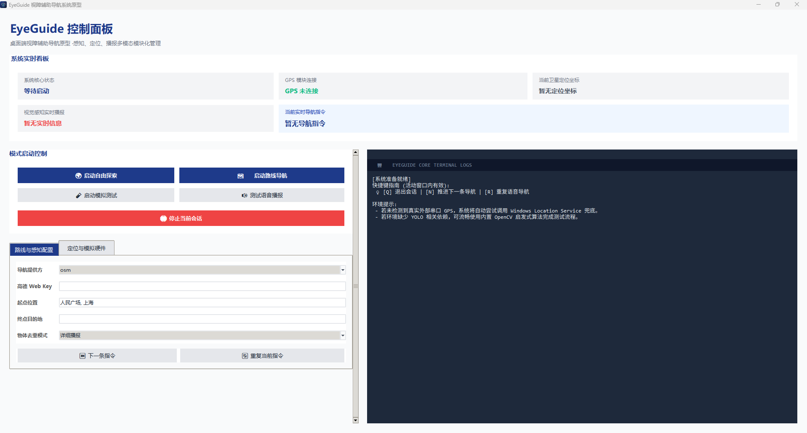
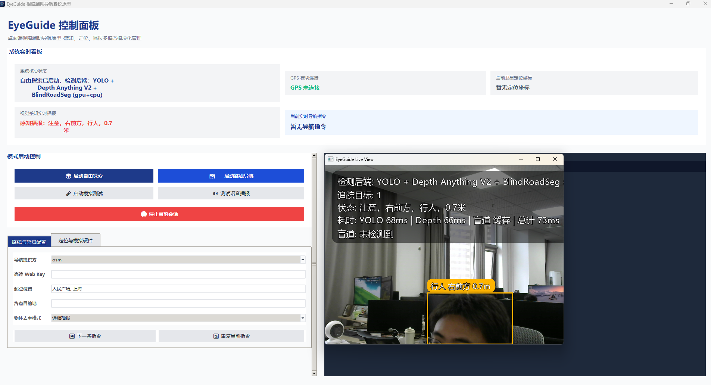

# EyeGuide

<p align="center">
  <strong>面向盲人出行辅助的桌面视觉导航原型</strong><br/>
  将 <code>YOLO</code>、<code>Depth Anything V2</code>、<code>盲道分割</code>、<code>GPS</code> 和 <code>TTS</code> 串成一条可运行、可验证、可继续演进的实时感知链路。
</p>

<p align="center">
  
  
  
  
  
</p>

---

## 项目简介

EyeGuide 不是一个单纯的目标检测 Demo，而是一个面向盲人出行辅助场景的桌面系统原型。它关注的不只是“看见了什么”，还包括：

- **前方有什么**：识别行人、车辆、障碍物、盲道等目标。
- **离我有多远**：结合单目深度估计补足距离信息。
- **是否值得提醒**：根据方向、距离、盲道状态筛选真正需要播报的风险。
- **如何提醒更自然**：通过优先级、冷却时间和长期去重控制语音播报。

项目当前的重点，是把“感知 -> 决策 -> 播报 -> 导航”这条链路完整跑通，方便后续继续替换更强的模型、更稳的定位方式和更贴近真实场景的交互设计。

---

## 功能展示

### 主界面总览

展示桌面原型的控制台界面、实时状态区、运行日志和配置面板。



### 实时检测效果

展示程序运行时的检测窗口、目标框、距离提示和当前视觉后端信息。



### 演示视频

以下视频不是最新版本，详情可见博客：[CSDN盲人出行辅助系统](https://blog.csdn.net/m0_74062928/article/details/161229133?spm=1011.2415.3001.10575&sharefrom=mp_manage_link)
- [盲人出行辅助系统](https://live.csdn.net/v/527244?spm=1001.2014.3001.5501)
- [盲道识别](https://live.csdn.net/v/527555?spm=1001.2014.3001.5501)

---

## 核心亮点

- **多模型实时协同**：`YOLO + Depth Anything V2 + 盲道分割` 并行执行，而不是串行等待。
- **面向通行风险而非纯识别**：不是检测到什么都播报，而是按距离、方向和盲道状态筛选真正需要提醒的内容。
- **盲道优先播报策略**：有盲道时优先播报盲道与盲道占用；没有盲道时再回到普通障碍物提醒。
- **长期去重播报**：支持普通物体提示的持久去重，避免同一目标反复播报。
- **GPU / CPU 可切换**：YOLO、深度估计、盲道分割都支持按模块配置运行设备。
- **完整桌面原型闭环**：包含 GUI、摄像头输入、视频模拟、GPS 接入、路线规划和语音输出。
- **训练链路已打通**：支持将 YOLO 格式盲道分割数据集转换为 PaddleSeg 格式，并直接启动轻量分割训练。

---

## 核心功能

### 1. 自由探索

打开摄像头后，实时识别前方目标、估计距离、判断方向，并通过语音提示近距离风险。

### 2. 路线导航

输入起点和终点后，结合 `OSM` 或 `高德 Web 服务` 生成步行路线，并在导航过程中结合实时画面持续提醒。

### 3. 盲道感知

项目已接入轻量分割模型，用于识别盲道区域，并判断盲道是否被障碍物占用。

### 4. 视频模拟测试

可以直接加载本地视频离线回放整条处理链路，方便调试、录屏和做模型对比。

### 5. GPS 接入

支持 `USB/NMEA GPS` 串口设备；串口定位不可用时，可尝试调用 Windows 定位服务作为补充。

---

## 技术栈

| 模块 | 技术方案 |
| --- | --- |
| 桌面界面 | `Tkinter` |
| 目标检测与跟踪 | `Ultralytics YOLO` + `ByteTrack` |
| 单目深度估计 | `Depth Anything V2` |
| 盲道分割 | `PaddleSeg` + `PP-MobileSeg-Tiny` |
| 导航服务 | `OSRM` / `Nominatim` / `高德 Web API` |
| 语音播报 | `SAPI` / `pyttsx3` |
| 视觉运行时 | `OpenCV` / `NumPy` |

---

## 处理流程

```text
摄像头 / 本地视频
    ->
视频帧读取
    ->
SceneAnalyzer
    |-- YOLO：障碍物检测与跟踪
    |-- Depth Anything V2：目标距离估计
    |-- BlindRoadSegmenter：盲道分割
    ->
风险筛选与播报策略
    ->
SessionController
    ->
语音播报 / GUI 叠加显示 / 路线导航
```

这个架构的关键点在于：**YOLO 在 EyeGuide 里只是障碍物感知前端，而不是最终决策者。**

---

## 快速开始

### 环境要求

- **Windows** 10 / 11
- **Python** `3.10+`
- **uv**
- 可选：`NVIDIA GPU`
- 可选：`USB/NMEA GPS` 设备

### 1. 克隆仓库

```bash
git clone https://github.com/Lii-sir/Eye-Guide.git
cd EyeGuide
```

### 2. 安装依赖

```bash
uv sync
```
或者
```bash
pip install -r requirements.txt
```

### 3. 启动程序

```bash
uv run eyeguide
```

或者：

```bash
python app.py
```

---

## 常用命令

### 启动桌面程序

```bash
uv run eyeguide
```
或者：

```bash
python app.py
```

### 启动图片搜索工具

```bash
uv run eyeguide-image-search
```

### 将 YOLO 分割标注转换为 PaddleSeg 数据集

```bash
uv run eyeguide-prepare-paddleseg
```

### 启动盲道分割训练

```bash
uv run eyeguide-train-blind-road-seg
```

---

## 使用说明

### 自由探索模式

适合快速验证视觉感知和语音播报链路。

1. 启动程序。
2. 点击“启动自由探索”。
3. 程序会打开默认摄像头并开始实时分析。
4. 当检测到近距离风险时，会触发语音播报。

### 路线导航模式

适合验证路线规划与实时感知协同。

1. 启动程序。
2. 选择导航提供方：`osm` 或 `amap`。
3. 如果使用高德，填写 `Amap Web API Key`。
4. 输入起点和终点。
5. 点击“启动路线导航”。
6. 如果出现多个候选终点，手动选择最符合预期的一项。

### 视频模拟模式

适合离线评估、录制演示视频和做模型回归测试。

1. 选择本地视频文件。
2. 点击“启动模拟测试”。
3. 程序会按实时流程分析视频，并在窗口内叠加检测与状态信息。

---

## 模型运行说明

### YOLO

- 默认权重位置：`models/YOLO/yolo26n.pt`
- 主流程采用 `track()` 模式，而不是单帧 `predict()`
- 默认结合 `ByteTrack` 保持跨帧目标 ID 稳定

### Depth Anything V2

- 用来补足检测框的距离估计
- 首次运行可能需要下载或加载本地缓存模型

### 盲道分割

- 当前轻量分割路线基于 `PP-MobileSeg-Tiny`
- 运行权重位于：`models/blind_road_pp_mobileseg_tiny/`
- Paddle 环境异常时，盲道分割可能会自动回退或不可用

---

## 训练工具

项目已经内置了盲道分割训练辅助脚本，适合继续做自己的数据闭环。

### 1. 数据集转换

如果你已经有 `YOLO` 格式的盲道分割标注数据：

```bash
uv run eyeguide-prepare-paddleseg
```

默认会把数据转换到：

```text
datasets/blind_road_paddleseg/
```

### 2. 启动训练

```bash
uv run eyeguide-train-blind-road-seg
```

默认配置文件位于：

```text
training/paddleseg/pp_mobileseg_tiny_blind_road_512x512.yml
```

默认输出目录位于：

```text
training/paddleseg/output/blind_road_pp_mobileseg_tiny/
```

---

## 项目结构

```text
EyeGuide/
├─ app.py
├─ pyproject.toml
├─ assets/
├─ eyeguide/
│  ├─ app/         # 会话编排、运行控制、导航流程
│  ├─ core/        # 配置、路径、事件定义
│  ├─ domain/      # 数据模型
│  ├─ services/    # 视觉、导航、语音、定位等核心能力
│  ├─ tools/       # 数据集准备、训练、图片搜索等脚本
│  ├─ ui/          # Tkinter 桌面界面
│  └─ main.py
├─ models/         # 本地模型权重，默认不提交
├─ datasets/       # 本地数据集，默认不提交
└─ training/       # 本地训练产物，默认不提交
```

---

## 路线图

### 已完成

- [x] 桌面 GUI 原型
- [x] YOLO 检测与跟踪接入
- [x] Depth Anything V2 距离估计
- [x] 盲道轻量分割接入
- [x] 盲道优先播报策略
- [x] 普通物体长期去重播报
- [x] 视频模拟测试模式
- [x] GPS 串口接入与导航联动

### 计划中

- [ ] 增加更稳定的 GPU 推理与依赖自检
- [ ] 补充更多真实路面演示素材
- [ ] 优化盲道占用判断的几何精度
- [ ] 引入更细粒度的障碍物类别
- [ ] 增加运行时配置面板
- [ ] 完善训练评估与模型导出流程

---

## 参与贡献

欢迎通过以下方式参与：

- 提交 `Issue` 报告 Bug、运行环境问题或误报案例
- 提交 `PR` 改进模型接入、工程结构、文档和 UI
- 提供真实路面素材、盲道场景视频和标注数据

如果你准备贡献代码，建议先：

1. Fork 仓库并创建新分支。
2. 使用 `uv sync` 或 `uv sync --extra yolo` 安装依赖。
3. 先用本地视频做回归测试，再提交修改。

---

## 已知限制

- 这是一个**研究原型**，不是经过医疗或安全认证的正式辅助设备。
- 单目深度估计给出的距离更适合作为风险参考，而不是严格测距结果。
- 第三方地图和定位服务的可用性会受到网络环境和接口状态影响。
- GPU 相关依赖在 Windows 上容易受到 CUDA、cuDNN、Torch、Paddle 版本匹配问题影响。

---

## 常见问题

### 1. 没装 YOLO 能跑吗？

可以。YOLO 不可用时，项目会回退到 OpenCV 启发式感知链路，但效果会明显弱于完整视觉后端。

### 2. 一定要 GPU 吗？

不是。CPU 可以跑通流程，但实时性会更弱。YOLO、Depth 和盲道分割都支持按模块配置 CPU / GPU。

### 3. 适合直接部署给真实用户吗？

暂时不建议。它更适合作为研究验证平台、课程项目、毕业设计原型或后续移动端系统的桌面实验场。

---

## 开源协议

先空着

---

## 致谢

- `Ultralytics YOLO`
- `Depth Anything V2`
- `PaddleSeg`
- `OSRM`
- `Nominatim`
- `Amap Web API`
